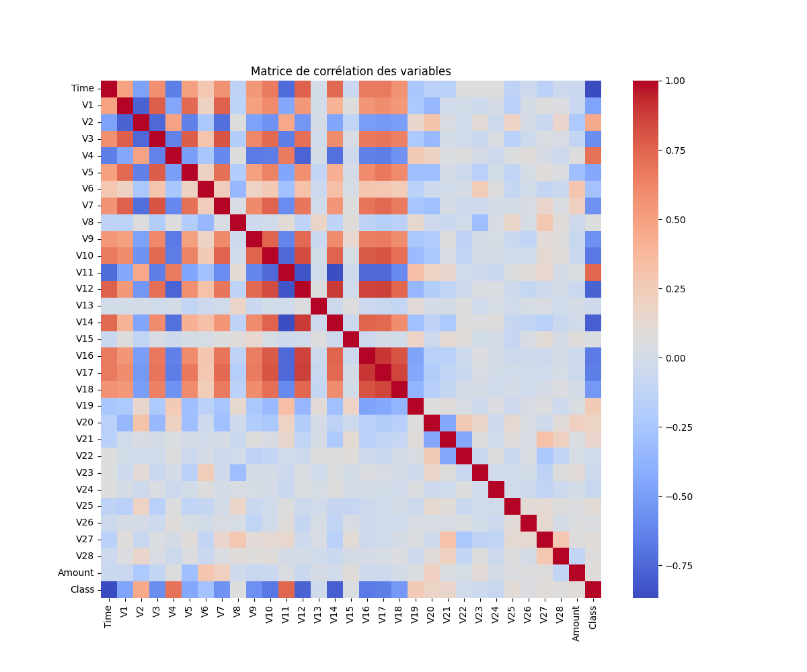
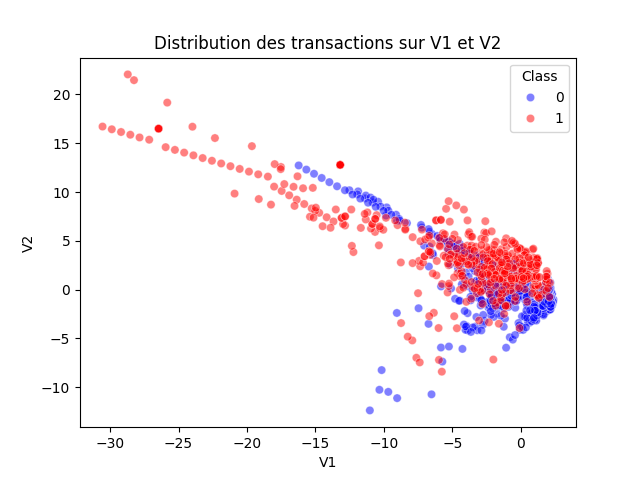

# Projet de Détection de Fraude par Carte de Crédit

## Objectif du Projet
Ce projet vise à détecter les fraudes dans un jeu de données de transactions par carte de crédit en utilisant des techniques de Machine Learning et Deep Learning. L'objectif est d'analyser les données, de réduire leur taille tout en conservant les informations critiques, et de visualiser des modèles pour améliorer la compréhension des comportements frauduleux.

---

## Structure des fichiers

1. **main.py**
   - Script principal orchestrant l'ensemble des opérations : réduction des données, analyse et visualisation.
   - Affiche le nombre de transactions légitimes et frauduleuses après traitement.
   - Appelle les fonctions des autres modules pour la réduction, la normalisation et la visualisation.

2. **scripts/cleanig_data_script.py**
   - **Réduction des transactions** : Conserve 1 % des transactions non frauduleuses et toutes les transactions frauduleuses.
   - **Réduction de dimensionnalité** : Sélectionne les colonnes les plus corrélées avec la variable cible.
   - **Normalisation des données** : Standardise les colonnes pour optimiser les modèles d'apprentissage.
   - **Statistiques essentielles** : Calcule la moyenne, l'écart-type, la médiane et l'IQR pour chaque variable.

3. **scripts/visualisation_script.py**
   - **Scatterplot (V1 vs V2)** : Visualise la distribution des transactions légitimes et frauduleuses.
   - **Matrice de corrélation** : Montre les relations entre les variables pour évaluer la pertinence des dimensions.

4. **data/**
   - **creditcard.csv** : Dataset original contenant les transactions avant traitement.
   - **reduced_creditcard.csv** : Dataset réduit généré après exécution du script principal.
   - **scaled_creditcard.csv** : Dataset normalisé.
   - **correlation_matrix.png** : 
   - **V1_V2.png** : 

5. **docs/**
   - **stats_summary.csv** : Statistiques essentielles générées par le script d'analyse.

---

## Présentation du Dataset

### 1. Intérêt personnel concernant la thématique
Ayant été pris en alternance dans une société de sécurisation de produits, je souhaitais m'entraîner à détecter des fraudes avant mon début de poste prévu pour le 6 janvier 2025. Ce projet me permet d'explorer des techniques d'analyse et de modélisation pour la détection des fraudes, ce qui est directement lié à mon futur rôle.

### 2. Contenu du dataset
Le dataset utilisé provient de transactions par carte de crédit. Il contient :
- **Colonnes** : 31 (28 colonnes anonymisées issues d'une PCA, 1 colonne 'Time', 1 colonne 'Amount' et 1 colonne 'Class').
- **Classe cible** : 0 pour les transactions légitimes et 1 pour les transactions frauduleuses.

### 3. Date de parution
Ce dataset a été initialement publié sur Kaggle et est devenu une référence pour les projets de détection de fraudes.

### 4. Nombre de lignes de données
- **Dataset initial** : 284 807 lignes.
- **Dataset réduit** : Environ 3 335 lignes après traitement (en gardant toutes les fraudes).

### 5. Pertinence des dimensions
- Les colonnes V1 à V28 proviennent d'une transformation PCA pour protéger la confidentialité.
- Ces colonnes capturent des informations utiles sur les relations complexes dans les données.
- Les colonnes 'Time' et 'Amount' ajoutent un contexte temporel et monétaire.

### 6. Contexte d'utilisation
Ce dataset est fréquemment utilisé dans les projets de détection d'anomalies et pour entraîner des modèles supervisés visant à distinguer des motifs frauduleux.

### 7. Exploitation possible des résultats
- Développement de modèles prédictifs pour détecter des fraudes en temps réel.
- Amélioration des systèmes de sécurité pour prévenir les activités malveillantes.
- Intégration dans des systèmes de surveillance automatique pour les transactions bancaires.

---

## Étapes du TP

### 1. Nettoyage et Préparation des Données
- Suppression des valeurs extrêmes et standardisation des colonnes.
- Réduction des transactions non frauduleuses pour équilibrer les classes.

### 2. Analyse Exploratoire
- Graphiques de dispersion sur les colonnes V1 et V2 pour observer la distribution des classes.
- Matrice de corrélation pour évaluer les relations entre les dimensions.
- Calcul des statistiques essentielles.

### 3. Visualisation des Résultats
- **Scatterplot** des variables principales.
- **Matrice de corrélation** pour valider la pertinence des variables conservées.

### 4. Prédictions et Modélisation
- Préparation pour entraîner des modèles de Machine Learning et Deep Learning.
- Optimisation des hyperparamètres et évaluation des performances.

---

## Installation et Exécution

### Prérequis
- Python 3.8+
- Bibliothèques nécessaires :
  ```bash
  pip install pandas numpy seaborn matplotlib scikit-learn
  ```

### Lancer le projet
```bash
python main.py
```

---

## Résultats obtenus
- Dataset initial : 284 807 lignes.
- Dataset réduit : Environ 3 335 lignes (incluant toutes les fraudes).
- Transactions légitimes et frauduleuses affichées dans la console.
- Graphiques et statistiques sauvegardés pour analyse ultérieure.

---

## Notes supplémentaires
- Ce projet peut être étendu avec des modèles d'apprentissage supervisé.
- La visualisation peut être enrichie avec d'autres dimensions (ex. V3, V4).
- Ajout potentiel d'un modèle de Deep Learning avec Keras/TensorFlow.

---

## Auteurs
- **Nom** : Paul Berdier
- **Formation** : Master 1 - Data Science et Intelligence Artificielle
- **Année** : 2024/2025
