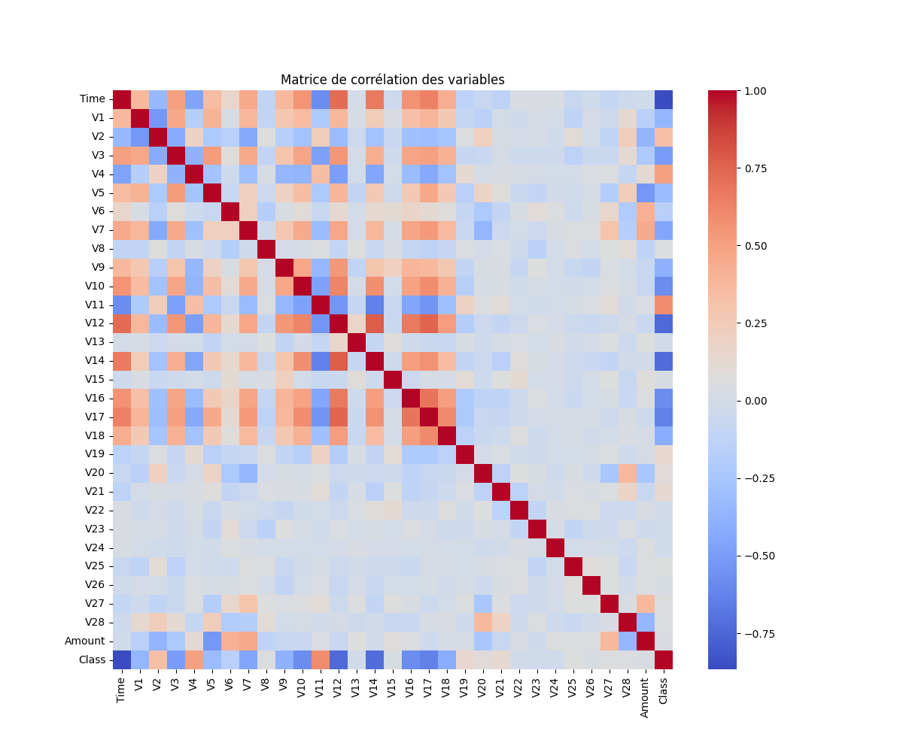
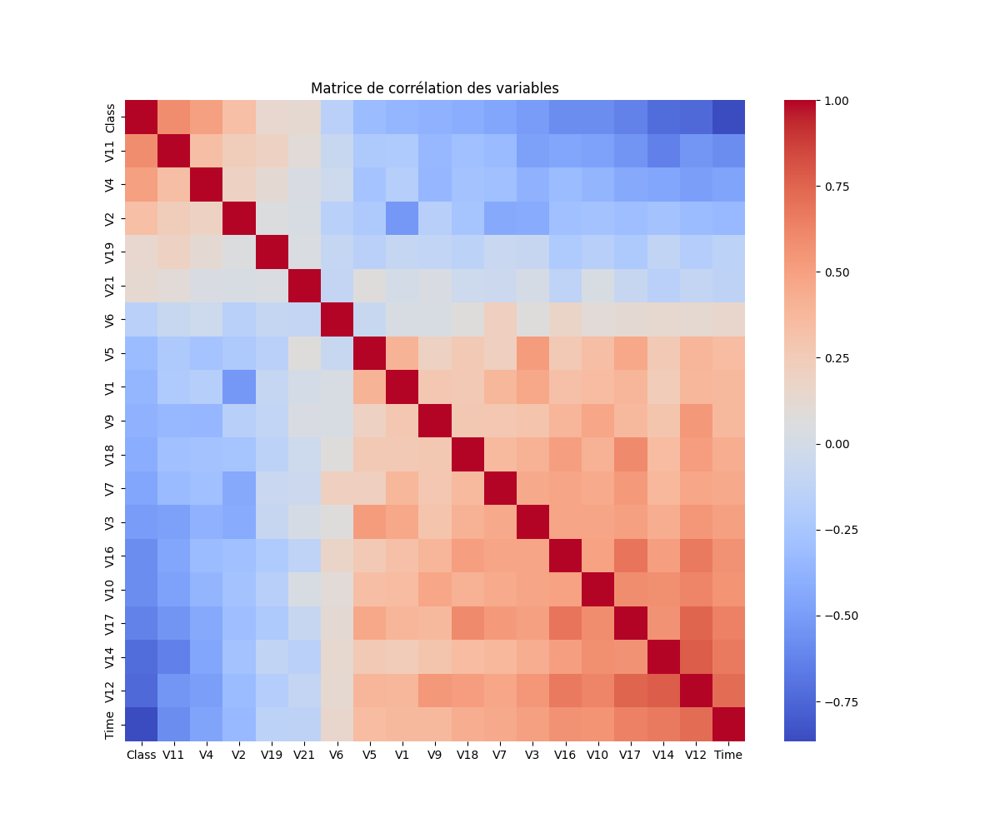
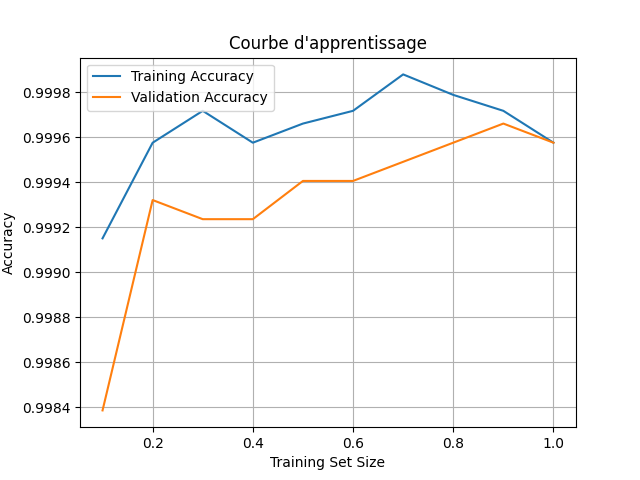
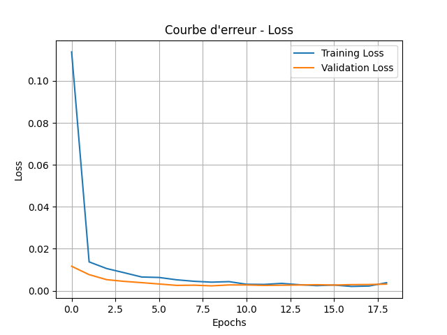

# Projet de Détection de Fraude par Carte de Crédit

## Objectif du Projet
Ce projet vise à détecter les fraudes dans un jeu de données de transactions par carte de crédit en utilisant des techniques avancées de Machine Learning et Deep Learning. L'objectif est de :
- Comprendre les comportements frauduleux.
- Réduire et normaliser les données pour des modèles optimaux.
- Visualiser et expliquer les relations dans les données.
- Entraîner et évaluer des modèles pour une prédiction précise.

---

## Structure des fichiers et dossiers

### Arborescence
Voici l'organisation des fichiers et dossiers du projet :

```
.
├── main.py                     # Script principal orchestrant toutes les étapes
├── requirements.txt            # Liste des dépendances nécessaires
├── scripts/                    # Contient tous les scripts de traitement et d'analyse
│   ├── cleanig_data_script.py  # Préparation et nettoyage des données
│   ├── visualisation_script.py # Visualisation des données et des résultats
│   ├── ML_model_training_script.py # Entraînement des modèles ML
│   ├── DL_model_training_script.py # Entraînement des modèles DL
│   ├── prediction_script.py    # Script pour effectuer des prédictions
├── data/                       # Dossier pour les fichiers de données (peut être vide au départ)
│   ├── creditcard.csv          # Jeu de données initial
│   ├── reduced_creditcard.csv  # Jeu de données réduit
│   ├── scaled_creditcard.csv   # Jeu de données normalisé
│   ├── reformed_creditcard.csv # Jeu de données sans la ligne isolée
│   ├── isolated_row.csv        # Ligne isolée pour prédiction
├── docs/                       # Dossier pour les graphiques et documents générés
│   ├── correlation_matrix_before.png # Matrice de corrélation avant réduction
│   ├── correlation_matrix_after.png  # Matrice de corrélation après réduction
│   ├── V1_V2.png               # Scatterplot des variables V1 et V2
│   ├── roc_curve.png           # Courbe ROC des modèles ML
│   ├── learning_curve.png      # Courbes d'apprentissage des modèles ML
│   ├── deep_learning_curve.png # Courbes d'apprentissage des modèles DL
│   ├── loss_curve.png          # Courbe de perte pour DL
├── models/                     # Dossier pour sauvegarder les modèles entraînés (vide au départ)
│   ├── ml_model.joblib         # Modèle ML entraîné
│   ├── deep_model.h5           # Modèle DL entraîné
```

---

## Fonctionnalités et Scripts Associés

1. **main.py**
   - Coordonne les étapes principales : nettoyage, visualisation, modélisation et prédiction.
   - Propose un menu interactif pour exécuter chaque étape.

2. **scripts/cleanig_data_script.py**
   - Réduction des transactions : Conserve 1 % des transactions non frauduleuses et toutes les fraudes.
   - Normalisation des données : Standardisation des colonnes pour uniformiser les échelles.
   - Calcul des statistiques essentielles : Moyenne, écart-type, médiane, IQR.
   - Isolation d'une ligne pour prédiction : Exclut une ligne aléatoire pour des tests indépendants.

3. **scripts/visualisation_script.py**
   - Visualisation V1 vs V2 : Analyse la distribution des classes (fraude ou non).
   - Matrice de corrélation : Met en évidence les relations entre les variables.
   - Courbes d'apprentissage : Montre les performances des modèles en fonction des données.

4. **scripts/ML_model_training_script.py**
   - Entraîne des modèles supervisés : Random Forest, Gradient Boosting, et Régression Logistique.
     - **Random Forest** :
       - Fonctionnement : Crée plusieurs arbres de décision entraînés sur des sous-ensembles aléatoires des données. Chaque arbre vote pour une classe, et la classe majoritaire est choisie.
       - Formule mathématique :
         \[
         P(C_k) = \frac{1}{N} \sum_{i=1}^{N} P(C_k | T_i)
         \]
         où \( T_i \) est un arbre parmi les \( N \) arbres, et \( P(C_k | T_i) \) est la probabilité prédite par l'arbre pour la classe \( C_k \).
       - Pourquoi ce choix ? : Très robuste, capable de gérer les données bruitées et les déséquilibres.
     
     - **Gradient Boosting** :
       - Fonctionnement : Entraîne successivement des modèles faibles (arbres) pour corriger les erreurs des prédictions précédentes.
       - Formule mathématique :
         \[
         F_m(x) = F_{m-1}(x) + \eta \cdot h_m(x)
         \]
         où \( F_m(x) \) est la prédiction au pas \( m \), \( h_m(x) \) est le nouvel arbre, et \( \eta \) est le taux d'apprentissage.
       - Pourquoi ce choix ? : Capture des relations complexes et offre d'excellentes performances pour des datasets difficiles.
     
     - **Régression Logistique** :
       - Fonctionnement : Prédit la probabilité qu'une observation appartienne à une classe donnée en utilisant une fonction sigmoïde :
         \[
         P(y=1 | x) = \frac{1}{1 + e^{-z}}, \quad \text{avec} \; z = w^T x + b
         \]
         où \( w \) est le vecteur de poids, \( x \) est le vecteur de caractéristiques, et \( b \) est le biais.
       - Pourquoi ce choix ? : Simple, rapide, et efficace pour des données linéairement séparables.

   - Optimise les hyperparamètres avec GridSearchCV.
     - Recherche systématique des meilleures combinaisons d'hyperparamètres pour chaque modèle.

   - Combine les modèles via un VotingClassifier.
     - Fonctionnement : Combine les prédictions de plusieurs modèles pour améliorer la robustesse.
     - Formule mathématique (soft voting) :
       \[
       P(C_k) = \frac{1}{M} \sum_{m=1}^{M} P(C_k | M_m)
       \]
       où \( M_m \) est un modèle parmi les \( M \) modèles.

   - Génère des courbes ROC et d'apprentissage.
     - **Courbe ROC** :
       - Montre la capacité du modèle à séparer les classes en traçant le Taux de Vrais Positifs (TPR) contre le Taux de Faux Positifs (FPR).
       - Formule :
         \[
         TPR = \frac{TP}{TP + FN}, \quad FPR = \frac{FP}{FP + TN}
         \]
       - Pourquoi ce choix ? : Mesure l'efficacité globale et l'équilibre entre précision et rappel.

5. **scripts/DL_model_training_script.py**
   - Entraîne un modèle de Deep Learning avec Keras.
     - Utilise plusieurs couches denses avec des fonctions d'activation ReLU et Sigmoid.
     - Descente de gradient :
       \[
       w \leftarrow w - \eta \cdot \nabla J(w)
       \]
       où \( \eta \) est le taux d'apprentissage et \( J(w) \) la fonction de coût.

   - Génère des courbes de précision et de perte.

6. **scripts/prediction_script.py**
   - Effectue une prédiction sur la ligne isolée.
   - Compare les résultats des modèles ML et DL avec le label réel.

---

## Résultats Obtenus

- **Précision des modèles** :
  - Machine Learning : AUC-ROC de 1.0 (Random Forest, Gradient Boosting, VotingClassifier).
  - Deep Learning : Précision et AUC de 1.0 après optimisation.

- **Visualisations** :
  - **Scatterplot des classes** (fraude vs non-fraude) :
    
  - **Matrice de corrélation avant réduction** :
    
  - **Matrice de corrélation après réduction** :
    
  - **Courbe ROC** :
    
  - **Courbes d'apprentissage pour ML** :
    
  - **Courbes d'apprentissage pour DL** :
    
  - **Courbe de perte pour DL** :
    

---

## Installation et Exécution

### Prérequis
- Python 3.5 - 3.9 (pour tensorflow...)
- Bibliothèques nécessaires :
  ```bash
  pip install -r requirements.txt
  ```
- Création des différents dossiers (même vides) :
  ```bash
  mkdir data docs models
  ```
- Téléchargez le fichier `creditcard.csv` depuis [Kaggle - Credit Card Fraud Detection](https://www.kaggle.com/datasets/mlg-ulb/creditcardfraud?resource=download) et placez-le dans le dossier `data`.

### Exécuter le Projet
1. Lancez le script principal :
   ```bash
   python main.py
   ```
2. Sélectionnez une option dans le menu interactif.

---

## Conclusions

### Points forts
- Les modèles de Machine Learning et Deep Learning ont obtenu des scores de précision élevés, démontrant leur capacité à s'adapter aux données traitées.
- Les courbes générées ont permis une bonne visualisation de la performance des modèles et de leur stabilité après optimisation des hyperparamètres.

### Limitations
- Le jeu de données initial contenait très peu de lignes représentant des transactions frauduleuses (98 sur 284 807). Après réduction, le dataset final contenait 667 lignes, ce qui a amplifié l'effet de déséquilibre des classes.
- Les scores de précision extrêmement élevés dès le départ (AUC-ROC de 1.0) indiquent un risque de surapprentissage. Cela est dû à la faible diversité des données et à leur réduction drastique.

### Perspectives d'amélioration
- Pour un projet futur, il serait pertinent d'utiliser un dataset plus équilibré ou contenant un plus grand nombre de transactions frauduleuses.
- Intégrer des techniques de génération de données synthétiques, comme SMOTE, pour équilibrer les classes avant l'entraînement.
- Tester les modèles sur des datasets plus complexes pour évaluer leur robustesse dans des scénarios réalistes.

---

## Auteurs
- **Nom** : Paul Berdier
- **Formation** : Master 1 - Data Science et Intelligence Artificielle
- **Année** : 2024/2025

